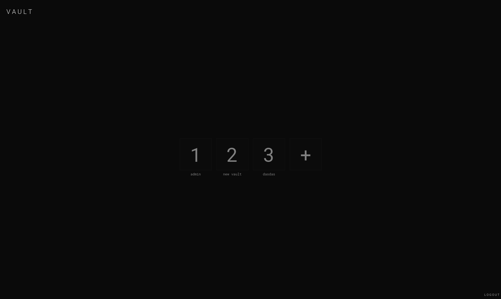
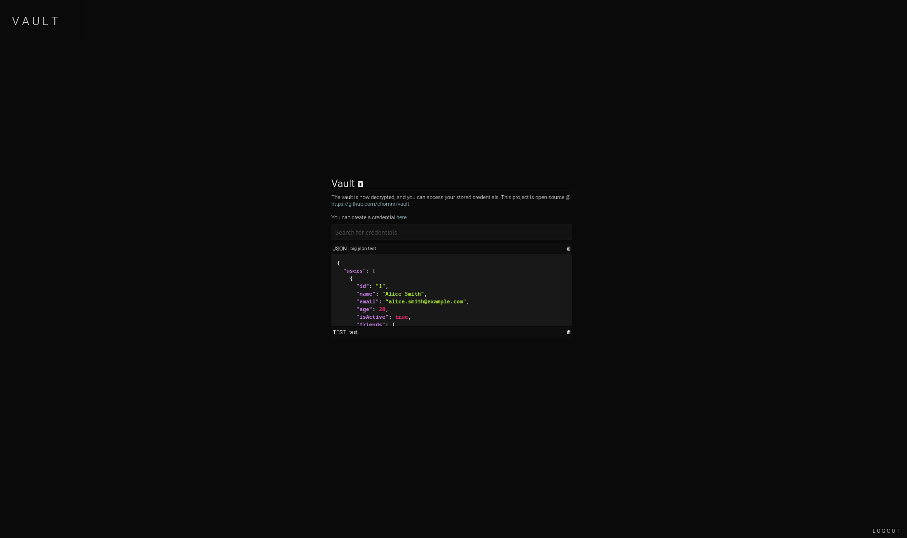

# Vault
> Vault  JSON-based Password Manager - Secure and Flexible

[](https://en.wikipedia.org/wiki/Advanced_Encryption_Standard)


A password manager project built with <b>Next.js</b>, <b>MongoDB</b>, <b>Prisma ORM</b>, and <b>TypeScript</b>. You can only have one user but multiple vaults, each vault having its own key (AES 256). Instead of being stored as plain text, all values associated with each individual credential are stored as JSON.
<div align="center">  </div>
<div align="center">  </div>


## Prerequisites
* [Git](https://git-scm.com/downloads)
* [Node 18](https://nodejs.org/download/release/latest-v18.x/)

## Installation
Necessary instructions in order to get Vault up and running.
```sh
# Clone Repository
git clone https://github.com/chomnr/vault.git
cd vault

# Install Dependencies
npm install

# Set Up Environment Variables
cp .env.example .env # fill everything out.

# Push the schema onto Mongodb database
npx prisma db push

# Run 
npm run build
npm start   
```

## Preview
You can preview the application [here](https://vault.pointless.ai/). Username and password is <b>admin</b>.